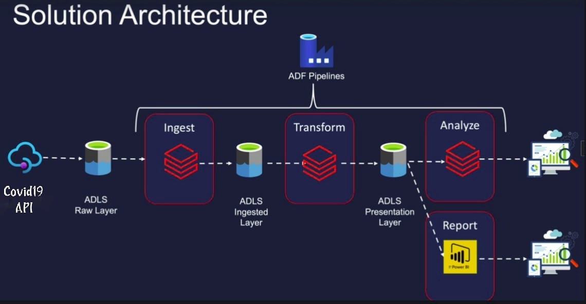

# covid19-analysis
# COVID-19 Data Pipeline on Azure (ADF + Databricks + Power BI)

## 📌 Overview
This project demonstrates an end-to-end data engineering pipeline to analyze COVID-19 data for 20 countries using Azure services.

## 🚀 Architecture

- **Data Source**: COVID-19 API (disease.sh)
- **Storage**: Azure Data Lake (Raw, Ingested, Presentation layers)
- **Orchestration**: Azure Data Factory
- **Processing**: Databricks (PySpark notebooks)
- **Reporting**: Power BI (interactive dashboards)

## 📂 Project Structure
- `notebooks/` : PySpark notebooks for ingest, transform, model, and analysis
- `architecture/` : Architecture diagrams
- `reports/` : Power BI dashboard screenshots
- `requirements.txt` : Python dependencies

## 🔑 Steps
1. Ingest API data to ADLS Raw layer using Databricks.
2. Transform & clean data into Ingested layer.
3. Create fact & dimension models in Presentation layer.
4. Visualize insights in Power BI.

## 📊 Dashboard

## ⚙️ Technologies Used
- Azure Data Factory
- Azure Data Lake Storage (Gen2)
- Azure Databricks (PySpark)
- Power BI
- Python, SQL

---
